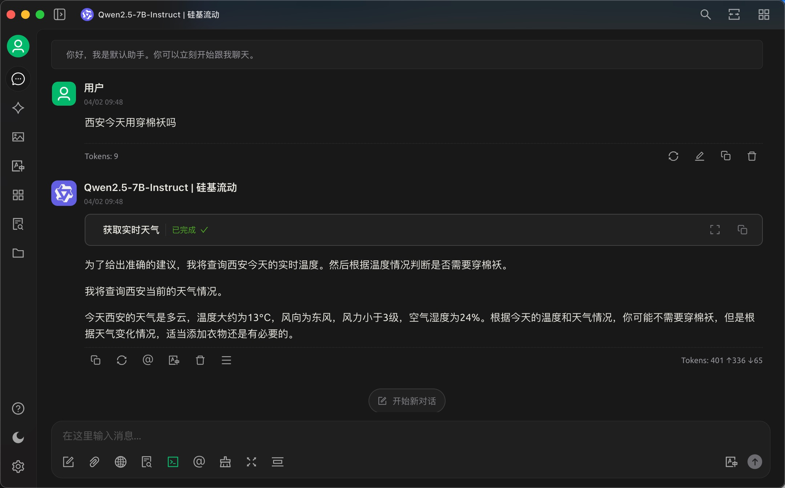
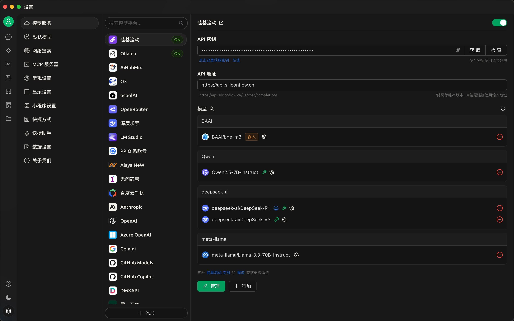
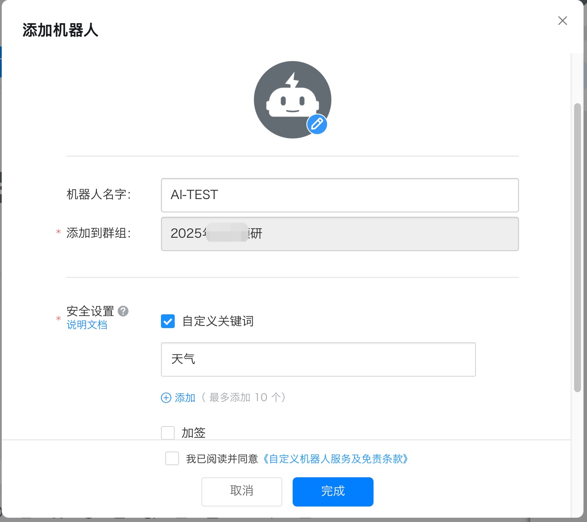
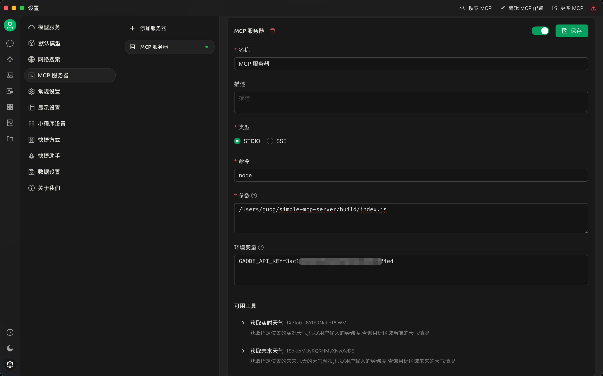
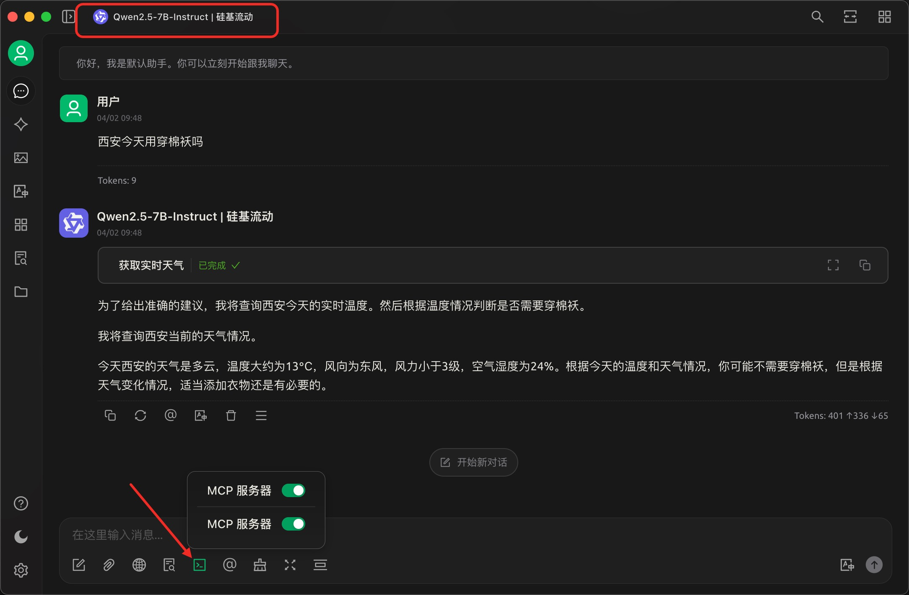

# Simple MCP Server

> 这是一个示例项目,用极简方式演示如何构建MCP Server。

本例使用高德开放平台提供的[天气查询API](https://lbs.amap.com/api/webservice/guide/api/weatherinfo)实现MCP Server，可获取实况和未来天气.

## 效果演示

如上图,其执行逻辑如下：

- 用户问"西安今天用穿棉袄吗"
- AI自动判断是否要调用天气MCP Server
- AI按照MCP Server的参数要求，将`西安`的经纬度信息提供给MCP Server
- MCP Server内部调用了高德提供的天气查询API，并将结果返回给AI
- AI将天气结果进行汇总整理，输出给用户

## 环境准备

### MCP Server 构建和执行

- [Node.js 22+](https://nodejs.org/zh-cn): 基础环境；
- [Pnpm](https://pnpm.io/zh/): 开发和构建。

### MCP Client和大模型

> 支持MCP协议的任何AI对话客户端程序都可以，如：Cline、Continue、Claude Desktop等, 本例使用Cherry Studio。

[Cherry Studio](https://cherry-ai.com/)

Cherry Studio是一个AI对话客户端，其支持很多个大模型提供商，如：硅基流动、阿里云百炼、OpenAI等几十个国内外提供商，各提供商分别提供很多大模型服务，各个大模型的能力也有差异，有免费和收费的，也有不同作用和能力的。
当然，Cherry Studio也支持本地运行的大模型，如：Ollama、LLM Studio等。

本文使用硅基流动提供的`Qwen2.5-7B-Instruct`模型，请先注册硅基流动账户，申请API密钥，并在Cherry Studio中配置API密钥。

**注意**：请选择带有`Function Call`功能的大模型(Cherry Studio中带🔧符合的大模型)，如：`Qwen2.5-7B-Instruct`。

### 高德开放平台API密钥

从高德开放平台[申请Web API密钥(key)](https://console.amap.com/dev/key/app)。

### 钉钉群API密钥

参见[钉钉开放平台——自定义机器人接入](https://open.dingtalk.com/document/orgapp/custom-robot-access)。

注意: 钉钉的本例中采用`安全设置/自定义关键字`方式，关键字为`天气`，如下图所示：

## 构建

- Clone本项目代码到本地,如`/Users/yourname/simple-mcp-server/`目录；
- 打开命令行工具;
- 跳转到此路径 `cd /Users/yourname/simple-mcp-server/`;
- 安装依赖 `pnpm i`;
- 构建 `pnpm build`.

构建完成后，在项目路径下会产生`build/index.js`文件。

构建的执行文件完整路径为:`/Users/yourname/simple-mcp-server/build/index.js`.

## 安装使用

在 Cherry Studio中打开`设置/MCP服务器`,添加MCP服务器，如下图：

- 名称: 随意写
- 类型：STDIO
- 命令：node
- 参数：刚才构建的执行文件路径,即`/Users/yourname/simple-mcp-server/build/index.js`
- 环境变量:
  - `GAODE_API_KEY` :高德开放平台申请的Web API **32位**密钥 `GAODE_API_KEY=your_api_key`
  - `DINGTALK_ACCESS_TOKEN`: 创建钉钉群机器人的Webhook 地址后面的**64位**密钥 `DINGTALK_ACCESS_TOKEN=your_access_token`

## 使用

在Cherry Studio中新建对话，对话框下方开启MCP服务器和刚才安装的MCP Server。

注意：当选择了带有`Function Call`功能的大模型时，下方才有MCP相关选项。

